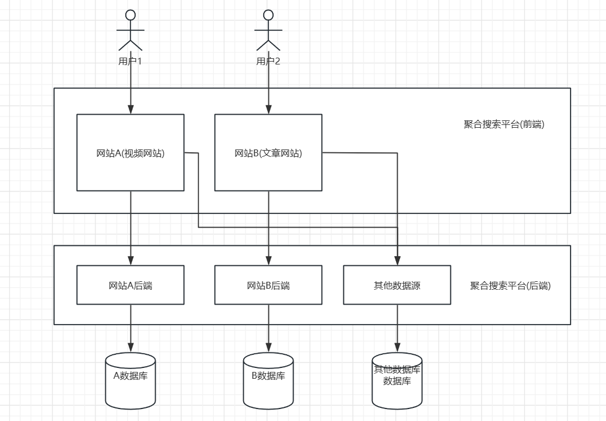
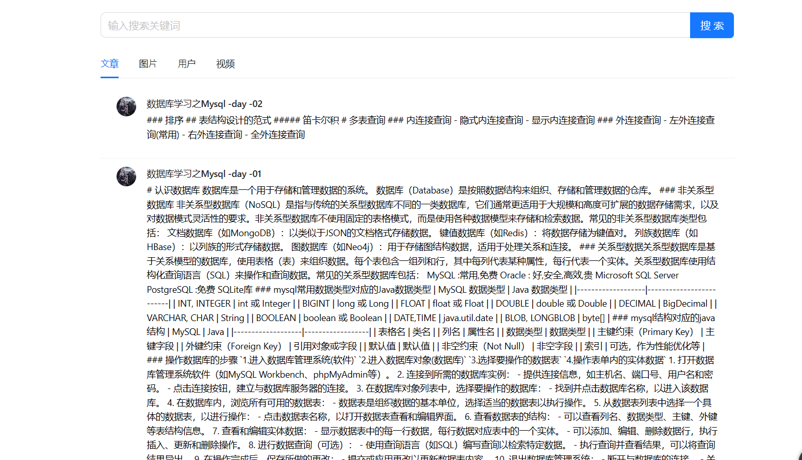
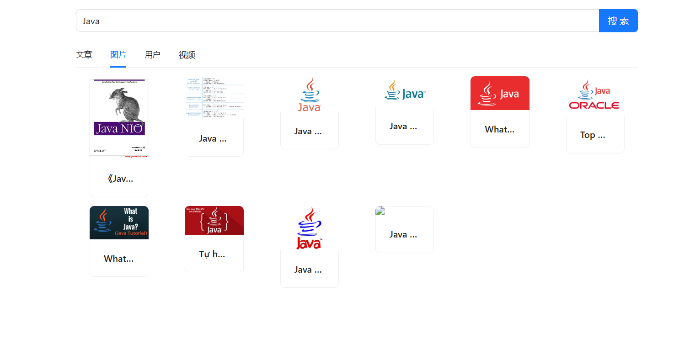

## 聚合搜索网站
> 基于 Vue 3 + Spring Boot + Elastic Stack 的一站式聚合搜索平台，也是简化版的企业级搜索中台。
## 系统架构

## 技术栈
#### 前端
- Vue 3
- Ant Design Vue 组件库
- 页面状态同步

#### 后端

- Spring Boot 2.7 框架 + springboot-init 脚手架
- MySQL 数据库（8.x 版本）
- Elastic Stack
    - Elasticsearch 搜索引擎（重点）
    - Logstash 数据管道
    - Kibana 数据可视化
- 数据抓取（jsoup、HttpClient 爬虫）
    - 离线
    - 实时
- 设计模式
    - 门面模式
    - 适配器模式
    - 注册器模式
- 数据同步（4 种同步方式）
    - 定时
    - 双写
    - Logstash
    - Canal
- JMeter 压力测试

## 项目展示

